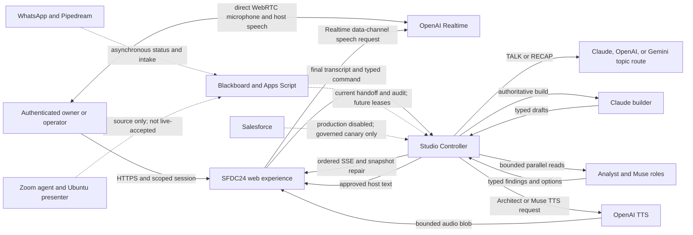
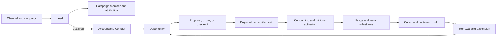
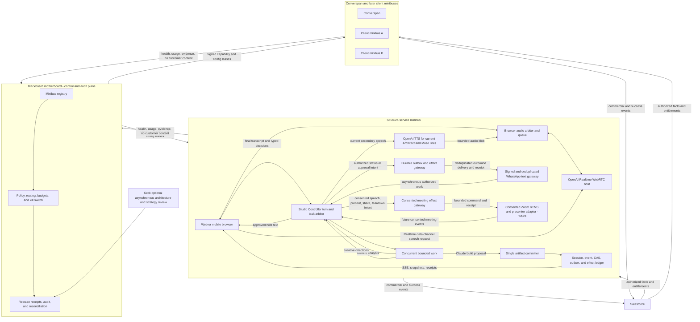

# ADR: Blackboard-governed SFDC24 and client minibus architecture

**Status:** Accepted architecture direction; staged implementation and acceptance pending<br>
**Decision date:** 2026-09-25<br>
**Decision owner:** Mr. Salam<br>
**Technical coordination:** Blackboard, Claude, Codex, Gemini, and Grok review lanes<br>
**Applies to:** SFDC24, future Converspan service, and later client minibuses

## PDF semantic contract

The fenced JSON below is the canonical revision and required-fact contract read
by `tools/build_sfdc24_architecture_pdf.py`. The generator refuses an ADR that
no longer contains a required fact, verifies that every required PDF fact was
actually sent to the renderer, and embeds the canonical contract digest in the
PDF metadata. The reviewed artifact SHA-256 is pinned in the adjacent
`.pdf.sha256` attestation. CI verifies that attestation before and after two
byte-identical rebuilds. Edit this block with any material architecture or
snapshot change; prose-only edits that preserve the contract do not churn the
published artifact.

<!-- architecture-pdf-contract:start -->
```json
{
  "schema_version": 1,
  "facts_refreshed_label": "26 Sep 2026 03:23 UTC",
  "facts_refreshed_iso": "2026-09-26T03:23Z",
  "production_controller_revision": "sfdc24-studio-controller-r5b-0895605",
  "production_controller_label": "R5b 0895605",
  "production_traffic_percent": 100,
  "site_commit": "e538ecfd763f91c0b1608f233f70bd2ecbd5dc65",
  "site_commit_label": "e538ecf",
  "advisor_enabled": false,
  "converspan_production": "HELD",
  "required_adr_phrases": [
    "Blackboard is the motherboard and durable control plane.",
    "sfdc24-studio-controller-r5-0895605-g",
    "Ready at 100% traffic",
    "3d9b4a1b8ed1cdb34a794fc134a19820cc810d04",
    "OpenAI Realtime is the live conversational host over direct browser WebRTC.",
    "The Studio Controller is the session coordinator",
    "Salesforce is the commercial and customer-success system of record.",
    "Foundry is excluded from this architecture.",
    "Converspan production implementation, deployment, and client onboarding",
    "Addendum 2026-09-26",
    "sfdc24-studio-controller-r5b-0895605",
    "Every future component carries a present status, its evidence, the test that promotes it, and its gate.",
    "e538ecfd763f91c0b1608f233f70bd2ecbd5dc65"
  ],
  "required_pdf_phrases": [
    "R5b serves 100%",
    "OpenAI Realtime",
    "OpenAI TTS",
    "Studio Controller - production R5b 0895605",
    "Claude builder",
    "Gemini advisor",
    "Blackboard motherboard",
    "Converspan minibus",
    "Salesforce commercial engine",
    "WhatsApp",
    "Zoom RTMS + Ubuntu presenter",
    "Foundry excluded",
    "Repository main e538ecf",
    "Proven toward the future",
    "Next promotions, in order",
    "Converspan launch gate",
    "Promotion ledger"
  ]
}
```
<!-- architecture-pdf-contract:end -->

## Decision summary

Blackboard is the motherboard and durable control plane. SFDC24 is the first
service minibus. Converspan and later client minibuses are governed descendants,
not independent copies with unrestricted credentials or authority.

Foundry is excluded from this architecture. Meta inference remains optional
and off until it has separate access, policy, cost, and acceptance evidence.

The Studio Controller is the session coordinator and sole artifact commit
authority. It may ask several model providers to work concurrently, but provider
outputs are typed proposals bound to one immutable tenant, subject, session,
turn, and artifact revision. Late, stale, malformed, over-budget, or
unauthorized contributions are discarded. A model response is never authority
to execute a tool, mutate Salesforce, deploy code, or commit a prototype.

The browser maintains one audio arbiter and queue. OpenAI Realtime is the live
host over WebRTC; the current implementation also plays controller-generated
OpenAI TTS blobs for the Architect and Muse through `/speak`. The browser must
serialize those sources so only one audible turn is active. Ordered prototype
events and snapshots use authenticated SSE/fetch because they need replay,
revision fences, and repair. The user should experience one uninterrupted
conversation even while Claude, Gemini, and later other providers contribute
behind the coordinator.

Blackboard controls enrollment, policy ceilings, provider availability, budget,
release receipts, reconfiguration, suspension, and retirement. It is not placed
in the low-latency media loop. Each minibus receives an expiring, least-privilege
capability and configuration lease and remains safe when Blackboard is briefly
unavailable.

Salesforce is the commercial and customer-success system of record. It tracks
acquisition, qualification, opportunity, payment and entitlement, onboarding,
support, product usage, renewal, expansion, and the ROI of each campaign and
service line. Effectful Salesforce changes require a durable operation ledger,
explicit authorization, dispatch-once semantics, independent destination
read-back, and reconciliation of ambiguous outcomes.

## Evidence language

This ADR deliberately separates four evidence levels:

1. **Source and CI:** code exists and its tests passed at an exact commit.
2. **Served bytes and configuration:** the expected artifact is publicly served
   or the runtime advertises a feature.
3. **Runtime/provider success:** a real authenticated request reached the
   intended provider and returned a bounded result.
4. **End-to-end acceptance:** a person completed the intended interaction on the
   real destination, including media, artifact, rollback, and authoritative
   read-back where applicable.

No lower level is described as proof of a higher level.

## Context and current-state snapshot

The system already contains a working foundation for a unified conversation and
prototype surface, but several client-isolation and effect-durability gates are
not closed. The following snapshot was refreshed on 2026-09-25.

| Area | Current evidence | Limit |
|---|---|---|
| Studio Controller | Production is Cloud Run revision `sfdc24-studio-controller-r5-0895605-g` from `0895605e1177a1162b01786f27f1bcb6dcce54fd`, Ready at 100% traffic. Repository `main` is `df443dac62881323426b1eaee06261e5f5b6645d`. After an unaccepted R6 revision briefly received traffic, containment restored R5, removed the `adv` tag, and created zero-traffic template revision `sfdc24-studio-controller-r6off-df443da` with `STUDIO_ENABLE_ADVISOR=false` | R6 had only health and rejected preflight probes in the inspected window; no `/advise` call was observed. Readiness, source, or configuration does not prove a real Gemini/provider result. `latestReadyRevisionName` lagged the normalized template and must not be treated as traffic proof |
| Public SFDC24 routing UI | Site `main` `3d9b4a1b8ed1cdb34a794fc134a19820cc810d04`; at 2026-09-25T12:55Z the production homepage and that exact source file were byte-identical at 143,343 bytes with SHA-256 `b66c94bfc6674060aa3cb98265b36c82e298c494a2cbb24472c9bc8d06a0e4dc` | Served bytes do not prove a complete authenticated voice/provider session |
| Voice | Browser-to-OpenAI Realtime WebRTC and controller `/speak` TTS are implemented. In a bounded authenticated browser/API rehearsal on production R5, `/voice` returned 200 and eight TTS blobs were delivered to the browser | An earlier voice-open returned 502. The later transport success does not prove physical-speaker playback, human-heard audio, microphone transcription, Gemini TALK, five visitor turns, two barge-ins, or the full ten-minute run |
| Gemini | Topic routing can select Gemini for website TALK/RECAP; production health lists Gemini. PR263/264 added advisor source to repository `main`; the weak R6 route is quarantined with no traffic or tag, and the current zero-traffic service template explicitly disables it | Production remains R5. No real Gemini advisor result was observed or accepted. Gemini is not an artifact builder; real spoken owner-path acceptance remains pending |
| Prototype surface | Typed event ledger, question/decision boxes, design directions, concurrent builder/Analyst/Muse calls, and snapshot repair exist. The bounded owner session launched all three lanes concurrently and visibly produced a landing page, demo form, and selected design direction | Provider attribution and all desired provider implementations are not complete; the session was not the full ten-minute acceptance |
| Client workspace | Prior PR260 head `cf8f5ac59c14cf1368c03a4f5273cb20c5403dc9` received an independent NO-GO. Current head `a2d98fc3aa97af36539fe2db593c81203c15975b` was open, cleanly mergeable, and had six green checks at 2026-09-25T12:56Z | The moved head has no fresh independent exact-head security ruling. Release remains held; prior findings are evidence to retest, not a verdict on replacement code |
| Shared workspace revisions | PR261 head `43eb4bf4dc2e426ac41ea835247391e8378be119` now targets PR260 head `a2d98fc3...` but reports `DIRTY`; its green checks finished before the base advanced | Held until PR260 is independently accepted, then conflict-resolved/rebased and reviewed. The prior lost-publication crash window must be retested |
| Salesforce | An operator-side query at approximately 2026-09-25T12:01Z against local alias `PlaygroundOrg` reported 22 Leads | This ADR did not capture an immutable Organization ID for that observation. Production reports `lead_facts:false`; website answer and metadata writes are not accepted capabilities |
| WhatsApp | Inbound messages have been observed and the outbox has provider-acceptance/message-ID evidence | Exact deployed Pipedream version and destination delivery are unverified; continuous audio, screen sharing, and session-to-prototype continuity are not proven |
| Zoom presenter | Source scaffolding exists for OAuth, RTMS, transcript, and assistant behavior | The Ubuntu presenter VM is stopped; live meeting listen/speak/share acceptance is absent |
| Meta | WhatsApp Business/Graph credential is configured; current source contains an optional Vertex Llama MaaS talk route | The Graph token is categorically unusable for inference. Vertex model access, licence acceptance, project configuration, and invocation IAM are absent |

Redacted R5 rehearsal receipt, 2026-09-25 beginning at approximately
12:26:17Z: authenticated session creation returned 200; `/voice` returned 200;
eight `/speak` responses delivered TTS bytes to the browser; `/commands`,
`/analyze`, and `/inspire` were dispatched concurrently and returned 200; the
landing page, demo form, and selected Clean Signal direction became visible;
and the bounded session ended cleanly. Session credentials and identifiers are
intentionally omitted. This is transport and visible-artifact evidence, not
human-heard audio or full continuous-audio acceptance.

Containment receipt, 2026-09-25T12:48Z-12:50Z: the traffic map was read back
with R5 at 100 percent and no R6 entry; the `adv` tag was absent; the former tag
URL returned 404; the default health response contained no `advisor` feature and
reported `public_visitors:false`; and the service template was normalized to
Ready zero-traffic revision `sfdc24-studio-controller-r6off-df443da` with the
advisor flag false. Release evidence must use the traffic map, exact revision
configuration, and destination health together, never `latestReadyRevisionName`
alone.

### Current logical architecture



## Goals

- Let a user speak naturally while seeing the requested website, application,
  illustration, or Salesforce work evolve in the same session.
- Keep the visible conversation coherent even when several agents are working.
- Show timely dialogue boxes that explain where a question fits, offer two or
  three meaningful options, and state each option's consequence.
- Provide fast first acknowledgement without sacrificing durable work,
  correctness, tenant isolation, or recoverability.
- Allow Blackboard to reconfigure, throttle, pause, upgrade, or retire a
  minibus without controlling every media packet or artifact delta.
- Make SFDC24 the proven platform foundation before productizing Converspan.
- Make every commercial interaction attributable and measurable in Salesforce.

## Non-goals

- Multiple models speaking independently into the user's audio session.
- Allowing arbitrary model-generated HTML, JavaScript, shell commands, SOQL,
  metadata operations, Git changes, or deployments to execute directly.
- Moving audio or high-frequency prototype deltas through Apps Script or the
  Blackboard Sheet.
- Treating a configured secret, green CI run, health flag, or HTTP 200 as
  end-to-end acceptance.
- Claiming WhatsApp audio/screen share, Zoom RTMS, Meta inference, Salesforce
  metadata mutation, or public client workspaces before their specific gates.
- Building or publishing Converspan before the SFDC24 tenant and durability
  foundations are accepted.

## Architecture decisions

### 1. Separate control, media, session, artifact, and effect planes

| Plane | Authority | Primary responsibilities |
|---|---|---|
| Control plane | Blackboard plus Apps Script gateway | Enrollment, policy, provider registry, budgets, ownership, release receipts, pause/kill, audit, and cross-agent handoff |
| Media plane | Browser audio arbiter, OpenAI Realtime, and current OpenAI TTS route | Direct WebRTC host audio, TTS blob playback for Architect/Muse, one serialized audible turn, interruption, and captions |
| Session plane | Studio Controller | Authentication, authorization, turn arbitration, immutable references, deadlines, cancellation state, contribution selection, and user-facing event order |
| Artifact plane | Studio Controller event ledger | Typed prototype operations, single-writer commit, versions, CAS, replay, snapshot repair, and rollback |
| Effect plane | Capability gateway plus durable operation ledger | Salesforce, messaging, publishing, repository, and meeting effects with confirmation, outbox, read-back, and reconciliation |
| Commercial plane | Salesforce | Campaign-to-revenue attribution and customer-success lifecycle |

Blackboard policy remains authoritative without becoming a single latency or
availability bottleneck. During a control-plane interruption, a minibus may only
render already-authorized state or edit an unsent local draft within a still-valid
low-risk lease. It may not begin a private server read, provider dispatch, or
external effect without an online membership, policy, and revocation check. It
fails closed when the lease expires and reconciles policy and receipts when the
control plane returns.

### 2. One audio arbiter and one artifact writer

- OpenAI Realtime is the live conversational host over direct browser WebRTC.
- Architect and Muse lines currently use controller-generated OpenAI TTS blobs.
- The browser audio arbiter serializes Realtime and TTS playback so only one
  audible line is active. Migrating all speech onto Realtime is a possible later
  simplification, not a description of the current deployment.
- The coordinator may use provider-generated text, but the trusted application
  decides what is voiced and the browser decides the playback order.
- Only the Studio Controller assigns event envelopes, sequence numbers, task
  revisions, and artifact versions.
- Claude remains the initial authoritative builder. Gemini is introduced as an
  advisory/Analyst contribution, not a second writer.
- Grok is an asynchronous architecture, adversarial, and strategy review lane
  through Blackboard until a separately bounded runtime role is accepted.
- Meta inference is optional and cannot reuse the WhatsApp Graph credential.

This avoids overlapping speech, competing canvas mutations, and partial merges
of incompatible model patches.

### 3. Immutable turn and contribution contracts

Every provider task is derived from a frozen reference similar to:

```json
{
  "tenant_id": "opaque-tenant-id",
  "project_id": "opaque-project-id-or-explicit-none",
  "subject_id": "opaque-authenticated-subject",
  "session_id": "opaque-session-id",
  "turn_revision": 17,
  "artifact_id": "opaque-artifact-id",
  "artifact_revision": 42,
  "policy_version": 9,
  "input_digest": "sha256:..."
}
```

The model returns only closed, schema-bounded content, not trusted metadata or
executable content:

```json
{
  "summary": "bounded plain text",
  "user_insight": "bounded plain text",
  "critique": "bounded plain text",
  "risk_flags": ["bounded-enum"],
  "alternative": "optional bounded plain text"
}
```

The trusted adapter/controller then creates the contribution envelope:

```json
{
  "provider": "gemini",
  "model": "pinned-model-id",
  "role": "analyst",
  "reference_fingerprint": "sha256:...",
  "status": "accepted-or-rejected-late-superseded",
  "content": "validated-model-content",
  "started_at": "controller-measured UTC timestamp",
  "completed_at": "controller-measured UTC timestamp",
  "usage": "allowlisted provider-reported counters plus controller cost class"
}
```

The model cannot choose provider identity, role, provenance, acceptance status,
timestamps, usage, or the authoritative fingerprint. The controller injects or
measures those fields and decides the disposition after all checks.

Before dispatch and after return, the coordinator rechecks tenant, project,
subject, session, turn, artifact revision, policy version, absolute deadline,
and budget. A mismatch is a rejected contribution, never a best-effort merge.

### 4. Concurrent work with deterministic arbitration

For a design turn, the coordinator can start these bounded tasks concurrently:

- Claude builder: prepares the only committable typed artifact proposal.
- Gemini Analyst: identifies domain entities, relationships, risks, and one
  decision with two or three consequential options.
- Creative/Muse role: returns exactly three bounded inspiration directions.
- Grok review: asynchronously challenges architecture, market assumptions, or
  release evidence when the request does not require hot-path latency.

Concurrency rules:

- One active audible response per session.
- One artifact-committing builder per session.
- One in-flight advisor task per provider per session and turn by default.
- Parallelism is allowed only for independent, read-only or proposal work.
- Every provider has a hard timeout, absolute deadline, input/output cap, cost
  class, global quota, tenant quota, circuit breaker, and bounded queue.
- The fast acknowledgement path is independent of durable build completion.
- Advisor failure is non-blocking; it is shown as unavailable only when useful
  to the user and does not silently switch authority.
- A late result is recorded as late/superseded and cannot change the artifact.

### 5. Interruption does not silently cancel durable work

“Stop speaking,” “stop this turn,” and “undo the last committed change” are
different operations:

- Stop speaking cancels the audible response, clears buffered playback, and
  floors the old voice turn.
- Queued but undispatched advisory work can be cancelled safely.
- In-flight reads may finish, but stale results are discarded.
- Uncommitted prototype proposals can be superseded.
- A committed artifact revision is preserved; correction creates a new revision.
- An external effect already dispatched becomes
  `UNKNOWN_PENDING_RECONCILIATION` if its result is ambiguous. It is never
  blindly retried or described as cancelled.

### 6. Dialogue and prototype remain in unison

The user sees a single ordered session timeline containing:

- live listening/speaking state;
- the user's finalized request;
- a short spoken acknowledgement;
- named agent activity without exposing hidden reasoning;
- progressive typed prototype changes;
- question cards placed at the relevant decision point;
- two or three selectable options with consequences;
- accepted decisions and the exact artifact revision they changed;
- a final spoken and visual recap.

The dialogue UI must never imply that several models are talking over one
another. Provider provenance is visible as supporting contribution labels such
as `Builder · Claude` and `Analyst · Gemini`; the host voice remains singular.

### 7. Minibuses use leases, not inherited omnipotent credentials

A minibus enrollment produces a signed, expiring capability/configuration
lease. The JSON below is the protected claims payload, not a complete bearer
credential. It is carried in an allowlisted JWS or equivalent signed envelope;
the signature is outside the claims and is verified before any claim is trusted:

```json
{
  "issuer": "blackboard-control-plane",
  "audience": "opaque-minibus-id",
  "jti": "unique-lease-id",
  "key_id": "rotation-key-id",
  "algorithm": "approved-signature-algorithm",
  "minibus_id": "opaque-id",
  "tenant_id": "opaque-id",
  "policy_version": 9,
  "allowed_capabilities": ["prototype.propose", "salesforce.read.lead_count"],
  "provider_routes": {"builder": "claude", "analyst": "gemini"},
  "budgets": {"requests_per_minute": 10, "daily_cost_class": "starter"},
  "issued_at": "UTC timestamp",
  "not_before": "UTC timestamp",
  "expires_at": "UTC timestamp",
  "credential_epoch": 4
}
```

Lease rules:

- signatures use an allowlisted algorithm and a rotating key identified by
  `key_id`; `issuer`, `audience`, `minibus_id`, tenant, `jti`, and time claims
  are all mandatory;
- the initial maximum TTL is five minutes with at most 30 seconds of verified
  clock skew; production telemetry must justify any change;
- the signed lease is a one-time bootstrap credential. Its `jti` is consumed
  exactly once and retained through lease expiry plus the skew window for
  single-use enforcement, audit correlation, and revocation deduplication. A
  successful online exchange returns a shorter-lived session/instance
  capability sender-constrained to an instance-generated key; subsequent calls
  prove possession of that key and cannot replay the bootstrap lease;
- only rendering already-authorized state, reading non-sensitive cached
  configuration, and editing an unsent local draft may continue during a
  Blackboard outage and only until lease expiry;
- private server reads, model/provider dispatch, credential minting, artifact
  commit, message send, repository action, payment action, deployment, and any
  external effect require an online membership, policy, suspension, and
  credential-epoch check and fail closed when that check is unavailable;
- the kill-switch propagation design target is 60 seconds for connected nodes.
  An online check rejects an invalid credential epoch immediately. Explicitly
  permitted offline low-risk work may continue only until the shorter of the
  five-minute bootstrap lease expiry, the derived capability expiry, or local
  suspension state; no new private read, provider dispatch, or external effect
  is permitted while offline;
- a signed lease grants capability but does not replace tenant storage,
  authorization, or data-egress controls.

The effective permission is the intersection of:

1. Blackboard's current ceiling;
2. the client's explicit grant;
3. the authenticated subject's current membership;
4. the operation-specific confirmation and destination policy.

The lease contains no customer content and grants no general access to another
client. Blackboard can reduce capabilities, rotate the credential epoch,
quarantine a provider, lower budgets, or suspend the minibus. The minibus must
recheck current membership online at every new private server read, server-side
command, provider dispatch, artifact commit, effect dispatch, private result
retrieval, and notification. Cached low-risk operations are limited to the
explicit offline exceptions above.

Each tenant/minibus also requires a separately testable data boundary:

- tenant-partitioned operational state and artifact namespace;
- tenant-scoped service identity and secret namespace;
- tenant-bound encryption key policy, retention/deletion schedule, backups, and
  restore test;
- tenant-partitioned audit and usage records;
- explicit provider-data-egress grants by capability and data classification;
- denial tests using a second tenant against reads, writes, provider prompts,
  logs, backups, notifications, and restored data.

### 8. Salesforce drives acquisition, revenue, and customer success

Salesforce is the revenue and customer-success system of record; it is not the
card-data processor. A PCI-compliant payment provider owns checkout and card
capture. Salesforce stores only tokenized customer/order references, signed
webhook receipts, amount, currency, status, entitlement, refund, and dispute
state. PAN, CVV, checkout secrets, and raw payment-provider credentials never
enter the Studio Controller, Blackboard, Salesforce free text, model prompts,
logs, or board rows.

Payment webhooks require signature verification, replay protection,
deduplication, durable outbox/reconciliation, and authoritative provider
read-back. An HTTP acknowledgement is not proof of settled payment.

The commercial lifecycle is:



Minimum tracked measures:

- spend, impressions, clicks, and inquiries by channel/campaign;
- qualified-lead and opportunity conversion rates;
- customer acquisition cost and payback period;
- average initial project revenue and gross margin;
- recurring revenue, usage, activation time, and support burden;
- retention, renewal, expansion, referral, and lifetime value;
- contribution margin by domain, minibus, provider, and customer cohort.

Free and low-cost demand tests should create Campaign and Campaign Member
records before paid scale. Google, YouTube, Meta, referral, Kijiji, marketplace,
organic, and direct outreach remain distinguishable sources. A lead is not
attributed to a paid channel merely because it arrived during that campaign.
The initial market offer is a narrow Web Sprint, with a discovery Clinic only
when it helps qualify work. No paid media is released from the CAD 3,000 ceiling
until the offer, fulfillment time, conversion event, and contribution-margin
measurement are validated through human-reviewed service delivery.

Salesforce consulting, an “Org Scan,” or other sold Salesforce services are not
part of the initial offer while the owner may enter a Salesforce Solution
Architect role. Salesforce remains the internal commercial engine. Any future
external Salesforce service needs an explicit employment/conflict and brand
review before it enters a campaign or price list.

For user-requested Salesforce changes:

1. read and bind the intended org;
2. describe the current schema;
3. produce an exact proposal and impact summary;
4. require an authenticated visual confirmation for a write;
5. preflight authorization and limits;
6. persist an operation and outbox intent before dispatch;
7. dispatch once with a stable effect key;
8. independently read the destination back;
9. record the immutable receipt or reconcile an ambiguous outcome.

Voice alone is insufficient authorization for metadata mutation.

## Future-state architecture



### Channel boundaries

- **Website/app:** primary interactive voice and prototype surface.
- **WhatsApp:** asynchronous status, intake, approvals that are safe for the
  channel, and urgent blocker notification. It is not the continuous audio or
  screen-share transport in the present architecture.
- **Zoom:** future consented meeting ingress through RTMS plus an on-demand
  Ubuntu presenter. It joins the same controller/session/effect rules; it does
  not become a separate artifact writer.
- **Pipedream:** bounded gateway and transformation role with deduplication and
  signatures where deployed. Early webhook acknowledgement is not durable
  completion; destination delivery needs its own receipt.
- **Apps Script:** control/audit gateway, not media transport.

## Performance and experience budgets

These are design budgets, not measured service-level claims:

| Interaction | Initial target |
|---|---|
| Local listening-state feedback | under 100 ms |
| Speech interruption to silence | p95 at or below 250 ms after real acceptance instrumentation |
| Spoken acknowledgement start | p50 under 1.5 s, p95 under 3 s |
| First visible useful prototype delta | p50 under 3 s, p95 under 8 s |
| Advisor contribution | soft deadline 3 s, hard deadline 8 s unless the task explicitly opts into background work |
| Session event propagation | p95 under 500 ms within the primary region |
| Snapshot repair after reconnect | p95 under 2 s for supported artifact sizes |
| Control-plane outage tolerance | operate only within the unexpired lease; fail closed afterward |

All targets require real production telemetry before being promoted to SLOs.

## Security and data requirements

- Never place provider keys, bearer tokens, OTPs, raw emails, Salesforce
  credentials, Blackboard secrets, or model bodies in URLs, logs, board rows,
  client code, or contribution receipts.
- Treat user pages, retrieved content, model responses, board text, and tool
  output as untrusted data, never executable instructions.
- Bind every private operation to issuer, subject, tenant, project, session,
  capability, policy version, and current membership.
- Normalize an absent project to an explicit sentinel; never omit tenant from a
  client session key.
- Apply admission, bounded execution, response-size limits, allowlisted URLs,
  DNS/IP and redirect validation, and per-tenant single-flight before remote
  fetch or model work.
- Default provider retention off where supported. A retention change requires a
  separate data-policy review.
- Require affirmative microphone activation and a persistent, accurate
  listening/processing indicator. Never infer consent from page load or a prior
  session.
- Require participant consent appropriate to the meeting and jurisdiction
  before Zoom media capture, transcription, generated speech, or presentation
  control. Store the consent decision and policy version within the tenant
  boundary.
- Default to no server-side raw-audio retention. Define an explicit per-tenant
  transcript retention and deletion policy before retaining transcripts, and
  make deletion independently verifiable.
- Session teardown must stop capture and playback, close browser/meeting media
  tracks and provider sessions, cancel pending speech, and reconcile any
  authorized outbound effect without silently extending listening.
- Redact errors into allowlisted codes; do not surface raw provider bodies or
  exception messages.
- A model may call only an internal typed capability gateway. It never receives
  a general provider credential or direct shell, Git, browser, deployment, CRM,
  messaging, or meeting authority.
- An external write requires a durable effect record, stable idempotency key,
  explicit confirmation where applicable, and authoritative read-back.

## Reliability and recovery

- Persist the command, artifact intent, outbox intent, and replayable receipt in
  one atomic admission boundary or an equivalent recoverable state machine.
- Never mark a command permanently complete before required artifact publication
  is durable or represented by a reconcilable outbox intent.
- Use optimistic concurrency/CAS for session and artifact state.
- Fence old workers by claim generation and artifact/turn revision.
- Limit remote work with bounded executors; a timed-out caller must not leave
  unbounded resolver or provider threads behind.
- Resolve timeout-after-dispatch through provider lookup, destination read-back,
  or an explicit hold. Do not retry an unknown external effect blindly.
- Preserve a known rollback artifact and exact source-to-runtime identity for
  every release.
- Run restart, ambiguous-send, stale-worker, replay, quota, and circuit-breaker
  tests before client rollout.

## Incremental release plan

### G1 - Accept the deployed Gemini website-talk path

No code change:

1. authenticate through the production owner path;
2. select or request website work;
3. prove the controller chose Gemini and returned a real provider response;
4. prove OpenAI Realtime spoke the approved response;
5. prove the Claude builder changed the prototype independently;
6. complete five turns, two barge-ins, three visible revisions, and ten
   uninterrupted minutes;
7. capture redacted provider, latency, event, artifact, and rollback receipts.

### G2 - Provider reliability

- Add definite-error fallback, provider circuit state, stale-turn fences, hard
  deadlines, bounded response bodies, and provider/model/latency/outcome receipts.
- Test timeout, quota, auth, malformed, refusal, empty, and recap-failure cases.
- Keep fallback visible in telemetry; do not mislabel the responding provider.

### G3 - Close the PR260 client-isolation gate

- Remediate PR260 tenant/project/subject binding, revocation enforcement,
  pre-admission fetch controls, parser deadline, bounded workers, and audit
  redaction.
- Rebase it onto current `main` and obtain a fresh exact-head independent review.
- Deploy disabled and at zero traffic; run cross-tenant and revocation negative
  controls.

### G4 - Close the PR261 durable-publication gate

- Begin only after PR260 has been accepted on its exact rebased head.
- Rebase PR261 onto the accepted PR260/main state.
- Persist publication intent durably with command completion, reconcile pending
  publication after restart, and return the same final receipt on replay.
- Inject a crash immediately after command/session commit and before workspace
  persistence; prove one publication and one receipt after recovery.
- Obtain a separate exact-head review and deploy disabled at zero traffic.

### G5 - Harden and accept Gemini Analyst as a dark advisory lane

- Treat the disabled server-side, stateless, no-tools contribution contract as
  landed in source; keep production on R5 while the quarantined R6 code is
  hardened. Create a new zero-traffic canary only from an accepted exact head.
- Bind tenant, project, authenticated subject, session, turn, and artifact
  revision.
- Use a pinned model, response-size cap, safe usage metrics, single-flight,
  global/tenant quota, and circuit breaker.
- Dark-probe with no user-visible or artifact authority.
- Then run Gemini in parallel with Claude builder using the existing closed
  Analyst schema and display `Analyst · Gemini` provenance.

### G6 - Salesforce read-only customer facts

- Bind the intended org by immutable Organization ID and environment type.
- Enable only fixed read-only tools such as Lead count and schema describe.
- Require the user response to identify the org binding and observation time.
- Compare the website result with a separate authoritative query.
- Keep mutations disabled.

### G7 - Durable effects and Salesforce mutations

- Land the operation ledger, explicit visual confirmation, dispatch-once outbox,
  independent destination read-back, and unknown-outcome reconciliation.
- Start in a sandbox with a narrow reversible metadata operation.
- Prove crash/restart, replay, duplicate suppression, revocation, and rollback.

### G8 - WhatsApp and Zoom channel expansion

- Harden WhatsApp inbound/outbound deduplication and read back actual delivery
  status, while retaining it as the status and blocker channel.
- Complete Zoom entitlement, OAuth consent, signed webhook/RTMS endpoint,
  on-demand presenter start, live listen/speak/share, reconnect, and teardown.
- Route both through the same session and effect authority.

### G9 - Converspan and client minibuses

- The non-waivable foundation gate is: accepted SFDC24 continuous-audio and
  live-prototype evidence from G1; provider fallback/deadline/circuit/telemetry
  controls from G2; exact-head PR260 tenant-isolation acceptance from G3;
  PR261 durable publication, restart, and replay acceptance from G4; immutable
  source-to-runtime receipts; and a tested rollback on production `main`.
- Strategy, documentation, and non-production design may continue before that
  gate. Converspan production implementation, deployment, and client onboarding
  may not begin before it passes.
- Enroll Converspan as a distinct tenant/minibus with an expiring capability
  lease, separate budgets, separate data boundary, and Blackboard kill switch.
- Run a zero/low-traffic canary, rollback drill, and 24/48-hour soak before
  broader client onboarding.
- Salesforce mutation, WhatsApp, Zoom, Meta, or another optional inherited
  capability must pass its own gate before Converspan may expose it; those
  optional capabilities do not all have to block a web-only minibus launch.

## Acceptance matrix

| Capability | Falsifiable pass condition | Current ruling |
|---|---|---|
| Gemini website TALK/RECAP | Authenticated website utterance selects Gemini, returns real output, is spoken once through the browser audio arbiter, and records bounded telemetry | Deployed and ready for acceptance; no microphone transcript/Gemini proof yet |
| Continuous audio | Real microphone/speaker session runs ten minutes with five turns and two barge-ins, without reconnect or transcript-only substitution | In an authenticated browser/API rehearsal, `/voice` returned 200 and eight TTS blobs reached the browser; physical playback, human-heard audio, microphone media, and full acceptance remain pending |
| Live prototype | Same session commits at least three visible typed revisions and reproduces the final artifact from the event ledger | Multiple visible revisions and dialogue choices observed in a bounded session; ten-minute/replay acceptance pending |
| Tenant isolation | Same subject and creation ID cannot read or reuse state across tenants, including blank project; revocation is enforced at every boundary | Prior PR260 head failed; current `a2d98fc3...` is clean with six green checks but has no fresh independent exact-head ruling. Release remains NO-GO pending that proof |
| Durable workspace publication | Crash after command admission recovers exactly one workspace publication and returns the same durable receipt on replay | Prior PR261 design failed; current `43eb4bf...` is dirty against advanced PR260 base `a2d98fc3...`; its checks predate that base. It must be conflict-resolved/rebased and independently reviewed after PR260 acceptance |
| Gemini Analyst | Bound, schema-valid, revision-current and turn-current result is non-blocking; stale/late/malformed/over-budget result cannot change artifact | Source merged; enabled R6 quarantined with no traffic/tag, zero-traffic service template normalized to advisor-off, and production restored to R5. No real provider result was observed or accepted |
| Salesforce Lead count | Spoken response matches separately read org count and includes immutable org binding and observation time | Production disabled |
| Salesforce mutation | Confirmed sandbox operation dispatches once, is read back independently, survives restart, and has a tested rollback or explicit non-rollback disposition | Not implemented |
| WhatsApp | One inbound message yields one authorized work item and one delivered outbound status with destination receipt | Partial asynchronous evidence only |
| Zoom | Consented real meeting receives media, speaks, presents, reconnects, and tears down through the same governed session | Not deployed |
| Converspan minibus | Cross-tenant tests, lease expiry, pause/kill, rollback, measured quotas, and soak all pass | Frozen pending foundation |

## Options considered

### Multiple realtime voice providers in the browser

Rejected for the first supported architecture. It creates competing VAD,
playback, cancellation, transcript, and audible-order authorities. Gemini Live
can be reconsidered for a distinct use case after the single-host design has
measured acceptance evidence.

### Multiple models writing the prototype directly

Rejected. Arbitrary patch merging is nondeterministic and makes rollback,
security review, attribution, and replay unreliable. Parallel providers produce
typed proposals; the controller remains the sole committer.

### Sequential model chain

Rejected as the default because latency accumulates and one provider outage
blocks all later work. Independent proposal lanes run concurrently behind hard
deadlines; only explicit dependencies are sequential.

### Blackboard or Apps Script in the media hot path

Rejected. They provide durable governance and coordination but add unsuitable
latency and availability coupling to live audio and high-frequency artifact
updates.

### Browser-held provider keys or direct browser model calls

Rejected. It exposes credentials, weakens tenant and budget enforcement, and
prevents one authoritative audit and cancellation boundary.

### Reuse the WhatsApp Meta token for model inference

Rejected. WhatsApp Business/Graph and Meta model inference use different
credentials, permissions, endpoints, terms, and billing boundaries.

### Launch Converspan immediately as a copy of SFDC24

Rejected. It would reproduce the unresolved tenant and durable-publication
defects and create a second production surface before the platform contract is
stable.

## Consequences

Positive consequences:

- The user gets one coherent conversation while several specialists work.
- Provider outages and slow advisors can degrade independently.
- Every visible change can be tied to an immutable turn and artifact revision.
- Blackboard retains governance without becoming the real-time bottleneck.
- Client minibuses can be tailored and retired without giving the motherboard
  unrestricted access to client content.
- Salesforce can measure both revenue and customer value across domains.

Costs and tradeoffs:

- The coordinator, revision contracts, outbox, reconciliation, and telemetry add
  engineering complexity.
- One audible host concentrates voice-provider dependency, so rollback and
  fallback behavior must be tested.
- Strong isolation and destination read-back make some effectful operations
  slower than direct model-to-API calls.
- Client rollout waits for security and durability evidence rather than only a
  compelling demonstration.
- Provider-specific capabilities are intentionally constrained to a common
  typed contract until they earn broader authority.

## Immediate ownership snapshot and stop rules

This is a non-authoritative snapshot refreshed through 2026-09-25T12:56Z. The
latest exact Blackboard work row, Git head, and repository owner supersede it.

| Lane | Work identity and exact state | Owner boundary |
|---|---|---|
| Current-state acceptance | `CODEX-AUDIO-PROTOTYPE-10H-ORDER-20260925T012936Z`; production controller `0895605...`; repository `main` `df443da...`; site `3d9b4a1...` | Claude leads implementation; Codex independently verifies source, runtime, and user-path evidence separately |
| Client workspace isolation | PR260 current head `a2d98fc3...`, open/clean with six green checks but no fresh independent exact-head ruling | Claude owns the implementation lane; fresh exact-head security review remains independent and is required before merge |
| Durable workspace publication | PR261 `43eb4bf...`, base `a2d98fc3...`, `DIRTY`; checks predate base advance | Held until accepted PR260; then Claude conflict-resolves/rebases and independent review restarts |
| Gemini advisor on `main` | PR263/264 merged as `df443da...`; enabled R6 was quarantined with no traffic/tag; zero-traffic template revision `r6off-df443da` explicitly disables it; production remains R5 | Exact-head independent review, stale-turn remediation, a real bounded provider probe, and activation hardening are required before creating or promoting a new canary |
| Gemini hardening reference | local unpushed branch `codex/gemini-advisor-contract`, head `7d48e391f9fbce15ee413b2739ac36fc071e1d3f` | Reference tests only; do not promote wholesale or duplicate the merged lane. Reuse bounded invariants in a focused follow-up if the exact-head review confirms gaps |
| Architecture directive | Blackboard row `CODEX-GROK-SFDC24-CONVERSPAN-BRIEF-20260925T1130Z` | Blackboard is the durable handoff record; this ADR requires exact commit/review receipts |
| Grok review | reply row `23d88c5e-b729-4080-ae68-45df81633c53`, disposition `ENDORSE_WITH_CORRECTIONS` | Optional asynchronous review; useful input, never a hot-path or acceptance dependency |

Converspan work remains frozen except for strategy, documentation, and
non-production design.

Stop the affected release for cross-tenant disclosure, authorization bypass,
unbounded remote work, secret exposure, conflicting artifact writers, unknown
external-effect ownership, unrecoverable publication, failed rollback, or an
unreadable authoritative destination. A stop on one path does not require
stopping safe, non-conflicting work on another path.

## Required follow-up records

- Exact owner-path G1 acceptance receipt.
- Fresh exact-head PR260 security ruling after remediation and rebase.
- Fresh PR261 durability/replay ruling after PR260.
- Gemini advisor contract review and dark-probe receipt.
- Salesforce read-only org-bound acceptance receipt.
- Updated two-page architecture PDF aligned with this ADR, with Foundry removed
  and current versus proposed capabilities labelled accurately.
- Google Drive publication and destination read-back for the revised PDF.
- Blackboard row linking each release receipt and final artifact digest.

## Addendum 2026-09-26 - evidence refresh and future-state promotion map

Facts verified at 2026-09-26T03:23Z, at publication of this edition. The
decisions above are unchanged. This addendum refreshes the snapshot contract
and produces `docs/SFDC24-BLACKBOARD-ARCHITECTURE-20260926.pdf`; the 2026-09-25
PDF stays committed as a historical artifact. Snapshot identities (FL): production
controller revision `sfdc24-studio-controller-r5b-0895605`; sfdc24-site repository
main `e538ecfd763f91c0b1608f233f70bd2ecbd5dc65`.

Every future component carries a present status, its evidence, the test that promotes it, and its gate.

**Source rule.** Each line below cites (a) the fact list recorded as Blackboard
row `CCC-ARCH-0926-FACT-LIST-20260926T0305Z` (cited as FL), (b) a repository
path, or (c) a named Blackboard row. The generator reads this block, renders it
unchanged, and fails the build (and so CI) if a line is not rendered or the
page asks for a line that is not here. Descriptive box and table text not
listed here is taken, sometimes shortened, from
`docs/SFDC24-BLACKBOARD-ARCHITECTURE-20260925.pdf` or from this ADR.

The block has three kinds of line, fields separated by ` || `:

- `r.` **review records** - reference, subject, exact head, Codex verdict (GO,
  NO-GO or PENDING), verdict row, note. Every Codex verdict on either page is
  rendered from one of these; free text and notes may not state a Codex verdict.
- `c.` **component records** - status, title, serving head, present evidence,
  promotion test, gate, dependencies. The generator draws both the page-2 box
  and the promotion-ledger row from the one record, and appends the verdict of
  each review the component depends on.
- `p1.` and `p2.` **free-text claims**.

The generator enforces: one status per component from LIVE, CURRENT, PARTIAL,
NO-GO, DARK, HELD, TARGET; every dependency exists (`c.`, `r.` or G1-G9) with
no cycles; a LIVE or CURRENT component depends on no review other than GO and
on no NO-GO, HELD, DARK or TARGET component; a NO-GO component depends on at
least one NO-GO review; and one verdict per (reference, head).

<!-- architecture-pdf-claims:start -->
- `r.site216` Site #216 || Site #216 (host nudge) || e5a9ae3 || GO || CODEX-SITE216-E5A9AE3-GO-20260926T0100Z || Merged 01:01Z. | Source: FL; row CODEX-SITE216-E5A9AE3-GO-20260926T0100Z
- `r.site221` Site #221 || Site #221 || 7a2685a || GO || CODEX-SITE221-7A2685A-GO-20260926T0153Z || A cleared nudge retracts its question; 20 s talk deadline; response-id ownership. | Source: FL; row CODEX-SITE221-7A2685A-GO-20260926T0153Z
- `r.site223` Site #223 || Site #223 (builder hears the answered question) || 89e3abc || NO-GO || CODEX-SITE223-89E3ABC-NOGO-CORRECTION-20260926T024146Z || An approval at 02:36Z was withdrawn at 02:41Z, after the 02:38:20Z merge; the audible-lifecycle and question-span fix-forward is site #224. | Source: FL; rows CODEX-SITE223-89E3ABC-GO-20260926T0236Z, CODEX-SITE223-89E3ABC-NOGO-CORRECTION-20260926T024146Z, CODEX-SITE223-89E3ABC-NOGO-ADDENDUM-20260926T024635Z
- `r.site222a` Site #222 || Site #222 (step descriptions and image captions) || 9f965e6 || NO-GO || CODEX-SITE222-9F965E6-NOGO-20260926T021638Z || Caption contrast. | Source: row CODEX-SITE222-9F965E6-NOGO-20260926T021638Z
- `r.site222b` Site #222 || Site #222 || ee80098 || PENDING || CCC-SITE222-EE80098-REVIEW-REQUEST-20260926T0312Z || Contrast repair; review requested. | Source: row CCC-SITE222-EE80098-REVIEW-REQUEST-20260926T0312Z
- `r.site224` Site #224 || Site #224 (#223 fix-forward) || a66b536 || PENDING || CCC-SITE224-A66B536-REVIEW-REQUEST-20260926T0314Z || Review requested. | Source: row CCC-SITE224-A66B536-REVIEW-REQUEST-20260926T0314Z
- `r.pr272` #272 || Blackboard #272 || 8a9349e || NO-GO || CODEX-PR272-8A9349E-NOGO-20260926T020927Z || Its provider timeout is per operation, not a total wall-clock deadline, and it classes permanent 400, 401 and 403 errors as timeouts. | Source: row CODEX-PR272-8A9349E-NOGO-20260926T020927Z
- `r.pr272b` #272 || Blackboard #272 || 29f0add || PENDING || CCC-PR272-29F0ADD-REVIEW-REQUEST-20260926T0320Z || Repair; review requested. | Source: row CCC-PR272-29F0ADD-REVIEW-REQUEST-20260926T0320Z
- `r.r5d` r5d || The r5d path (0895605 plus #272 only) || 8a9349e || NO-GO || CODEX-R5D-8A9349E-NOGO-20260926T0231Z || Its validation image is do not promote; r5b stays at 100%. | Source: rows CODEX-R5D-8A9349E-NOGO-20260926T0231Z, CCC-R5D-NOGO-ACK-20260926T0238Z, CODEX-PR274-31DBBBB-ARCH-NOGO-20260926T0306Z
- `r.pr260` #260 || #260 client workspaces (Nav / steelworkson.ca), Gate 1 || ecee267 || NO-GO || CODEX-PR260-ECEE267-GATE1-NOGO-20260926T021501Z || Four reproduced boundary failures. The outcome durability and terminalisation finding passed. | Source: FL; row CODEX-PR260-ECEE267-GATE1-NOGO-20260926T021501Z
- `r.pr260b` #260 || #260 client workspaces, Gate 1 || cfdebac || PENDING || CCC-GATE1-REVIEW-REQUEST-PR260-CFDEBAC-20260926T0318Z || Round-12 repair head; review requested. | Source: row CCC-GATE1-REVIEW-REQUEST-PR260-CFDEBAC-20260926T0318Z
- `p1.prod` R5b serves 100%; rollback r5-0895605-g; r5c at 0% | Source: FL
- `p1.realtime` Direct browser WebRTC host; the response.metadata echo on created and done was probed on gpt-realtime-2.1. | Source: FL
- `p1.controller` Cloud Run request timeout 60 s, concurrency 8, 1 CPU / 512Mi; worker model claude-sonnet-5. | Source: FL
- `p1.incident` Codex got 401 from its upstream credential 25 Sep 22:38-23:30Z; an app restart fixed it; the production OpenAI key was unaffected. | Source: FL; rows CCC-OPENAI-CODEX-401-DIAG-20260925T2332Z, CODEX-ALIVE-20260926T000934Z
- `p1.repo` Repository main e538ecf: the #223 merge, 26 Sep 02:38:20Z. | Source: FL; row CODEX-SITE223-89E3ABC-NOGO-CORRECTION-20260926T024146Z
- `p1.served` Last observed served bytes, 02:42Z: two cache-busted reads of voice-conversation.js matched #223's reviewed head. | Source: row CODEX-SITE223-89E3ABC-NOGO-CORRECTION-20260926T024146Z
- `p1.run` Worked: session, voice, TTS, concurrent analyze, inspire and commands, recap, rating, and the summary-PDF handoff to the mail sender (HTTP 200; delivery not verified). Defect 1: one builder POST hit 504 at 60.0 s, then a 90 s inflight lease returned 409 to five builds, about 3 minutes of architect silence. Defect 2: /analyze also hit 504 at 60 s. Defect 3: the canvas was sparse after the first build; the builder held changes back to ask questions that the analyst lane discards. | Source: FL
- `p1.r261` #261 is stacked on #260; STUDIO_CLIENT_WORKSPACES is off and the registry is not seeded. | Source: FL
- `p1.dark` Dark source in main: #269 charter lane and quote PDF (STUDIO_ENABLE_CHARTER false, empty price table) and the Gemini advisor (off). #270 talk prompts: merged source, not in the serving image. | Source: FL; row CODEX-PR274-31DBBBB-ARCH-NOGO-20260926T0306Z
- `p1.unchanged` Unchanged: Zoom RTMS and Ubuntu presenter held; Salesforce writes paused (BLK-059); Converspan held. | Source: FL
- `p1.legend` LIVE serving; CURRENT present; PARTIAL bounded proof; NO-GO rejected exact head; DARK merged source, switch off; HELD gated; TARGET future. Foundry excluded; Meta optional/off. | Source: `docs/SFDC24-BLACKBOARD-ARCHITECTURE-20260925.pdf` legend; NO-GO and DARK defined by this addendum
- `p1.tts_row` Controller-generated Architect and Muse speech through the browser queue. | Source: this ADR, Decision summary
- `p2.return` Minibus returns carry health, usage, policy and release versions and redacted acceptance and outcome evidence; never customer content, transcripts, canvases, personal data, credentials or provider bodies. | Source: row CODEX-PR274-31DBBBB-ARCH-NOGO-20260926T0306Z (finding 4); this ADR, Future-state architecture
- `p2.proven_main` Repository main e538ecf carries #209, #216 and #221. | Source: FL
- `p2.proven_rest` Realtime's response.metadata echo was probed on gpt-realtime-2.1. Analyze, inspire and commands ran concurrently in the 26 Sep owner run. Exact-head reviews held #272 and the r5d path before any deploy. | Source: FL; rows CODEX-R5D-8A9349E-NOGO-20260926T0231Z, CCC-R5D-NOGO-ACK-20260926T0238Z
- `p2.order` 1 #272 repaired on a fresh exact head, independent acceptance, then a newly verified image; each requires Codex GO. 2 Deploy, traffic and the owner rehearsal (targeted G1 close) are gated separately. 3 Complete G2 and the #260 gate, then #261. 4 Repair and review #269; CX1 charter-only operator canary with PDF and price effects off; CX2 unpriced and fully priced quote canaries after the owner's commercial gates. Traffic is a separate GO. Then ADR G5-G9. | Source: row CODEX-R7-PLAN-AMEND-20260925T1854Z (sequence); rows CODEX-PR274-31DBBBB-ARCH-NOGO-20260926T0306Z (finding 1), CODEX-PR274-31DBBBB-NOGO-20260926T030702Z (accept 2 and 3); this ADR, Incremental release plan
- `p2.gate` ADR G9 in full: G1 continuous-audio and live-prototype evidence; G2 provider reliability; exact-head #260 (G3) and #261 (G4) acceptance; immutable source-to-runtime receipts; a tested rollback on production main. Soak: minimum sessions, turns and concurrency, the candidate revision and config, a reset-on-failure rule, and 24 h versus 48 h exit criteria, to be set by Codex/owner. Rollback: RTO to be set by Codex/owner, with traffic, image, config, state and log read-back. Each minibus: its own tenant and subject binding, runtime identity, secret, signed lease and revocation, budget, provider egress, privacy, microphone, retention, restore and deletion decisions, isolation and denial tests, release receipt, kill switch, canary and rollback. No minibus inherits Converspan's soak. | Source: this ADR, G9; rows CODEX-PR274-31DBBBB-ARCH-NOGO-20260926T0306Z (finding 3), CODEX-PR274-31DBBBB-NOGO-20260926T030702Z (finding 4 and accept 4)
- `c.mother` PARTIAL || Blackboard motherboard || - || Now: current handoff and audit; signed leases and the kill switch are future. || Kill switch reaches connected nodes within the 60 s design target. || G9 enrollment || G9 | Source: this ADR, Current logical architecture, decision 7 and G9
- `c.realtime` PARTIAL || OpenAI Realtime || - || Now: live WebRTC host; audio not yet accepted. || Ten minutes, five turns, two barge-ins, no reconnect or transcript-only substitution. || G1 || G1 | Source: FL; this ADR, Acceptance matrix (Continuous audio) and G1
- `c.tts` PARTIAL || OpenAI TTS || - || Now: Architect and Muse speech as audio blobs. || Spoken once through the browser audio arbiter in that session. || G1 || G1 | Source: `docs/SFDC24-BLACKBOARD-ARCHITECTURE-20260925.pdf` page 1; this ADR, Acceptance matrix (Gemini website TALK/RECAP) and G1
- `c.web` PARTIAL || Web / mobile || e538ecf || Now: authenticated owner session. || No cross-tenant read or reuse; revocation enforced at every boundary. || G3 || G3, r.site223 | Source: `docs/SFDC24-BLACKBOARD-ARCHITECTURE-20260925.pdf` page 1; this ADR, Acceptance matrix (Tenant isolation) and G3
- `c.wa` PARTIAL || WhatsApp || - || Now: outbound accepted (HTTP 200); delivery unverified. || One inbound message, one authorized work item, one delivered status with destination receipt. || G8 || G8 | Source: FL; row CODEX-WA-SFDC24-PR221-STATUS-20260926T022002Z; this ADR, Acceptance matrix (WhatsApp) and G8
- `c.zoom` HELD || Zoom RTMS + Ubuntu presenter || - || Now: source only; the Ubuntu presenter VM is stopped; no live meeting acceptance. || A consented real meeting: media, speak, present, reconnect, tear down. || G8 || G8 | Source: this ADR, Context and current-state snapshot (Zoom presenter), Acceptance matrix (Zoom) and G8
- `c.arbiter` PARTIAL || One browser audio arbiter || e538ecf || Now: one queue, with response-id ownership and a 20 s talk deadline. || Two barge-ins inside the ten-minute continuous-audio session. || G1 || G1, r.site221 | Source: FL; this ADR, Acceptance matrix (Continuous audio) and G1
- `c.controller` PARTIAL || Studio Controller turn and task arbiter || r5b-0895605 || Now: r5b at 100%; the builder and /analyze hit Cloud Run's 60 s limit on 26 Sep; #272 in repair. || G2: end-to-end deadlines, cancellation, fallback, circuit state, stale-turn fences, bounded bodies, receipts, fault tests. || G2 || G2, r.pr272, r.pr272b | Source: FL; row CODEX-PR272-8A9349E-NOGO-20260926T020927Z; this ADR, G2
- `c.ledger` PARTIAL || Session, event + CAS ledger || r5b-0895605 || Now: GCS CAS state, fenced revisions and replay; #260's outcome durability finding passed. || Final artifact reproduced from the event ledger (G1); one publication and one receipt after a crash (G4). || G1, G4 || G1, G4, r.pr260 | Source: `docs/SFDC24-BLACKBOARD-ARCHITECTURE-20260925.pdf` page 1; row CODEX-PR260-ECEE267-GATE1-NOGO-20260926T021501Z; this ADR, Acceptance matrix, G1 and G4
- `c.work` PARTIAL || Concurrent bounded work || r5b-0895605 || Now: analyze, inspire and commands ran concurrently in the 26 Sep run; Gemini advisor dark. || A stale, late, malformed or over-budget Gemini result cannot change the artifact. || G5 || G5 | Source: FL; this ADR, Acceptance matrix (Gemini Analyst) and G5
- `c.commit` PARTIAL || Single artifact committer || r5b-0895605 || Now: the controller alone validates and commits. || At least three visible typed revisions in one session. || G1 || G1 | Source: `docs/SFDC24-BLACKBOARD-ARCHITECTURE-20260925.pdf` page 1; this ADR, Acceptance matrix (Live prototype) and G1
- `c.outbox` TARGET || Durable outbox + capability gateways || - || Now: a channel outbox exists; the dispatch-once effect outbox is G7. || A confirmed sandbox operation dispatches once, is read back, survives restart, has a tested rollback. || G7 || G7 | Source: `docs/SFDC24-BLACKBOARD-ARCHITECTURE-20260925.pdf` page 1 (Pipedream + outbox); this ADR, Acceptance matrix (Salesforce mutation) and G7
- `c.charter` DARK || Charter + quote PDF (#269) || - || Now: in main, switched off; empty price table. || Repair and review #269; CX1 with PDF and price effects off; CX2 after the owner's commercial gates. || CX1, CX2 || c.controller | Source: FL; row CODEX-R7-PLAN-AMEND-20260925T1854Z
- `c.converspan` HELD || Converspan minibus || - || Now: production frozen until SFDC24 foundation gates pass. || ADR G9 in full, including G2 and its own enrollment (launch gate box). || G9, non-waivable || G9, c.controller, c.web, c.ledger | Source: `docs/SFDC24-BLACKBOARD-ARCHITECTURE-20260925.pdf` page 2; this ADR, G9
- `c.nav` HELD || Nav / steelworkson.ca minibus || - || Now: workspaces off. || #260 exact-head acceptance (G3), #261 (G4), then its own G9 enrollment. || G3, G4, G9 || G3, G4, G9, r.pr260, r.pr260b | Source: FL; row CODEX-PR260-ECEE267-GATE1-NOGO-20260926T021501Z; this ADR, G3, G4 and G9
- `c.clients` TARGET || Additional client minibuses || - || Now: selected design only. || Each its own G9 enrollment; Converspan's soak is evidence, not approval. || G9 || G9, c.converspan | Source: `docs/SFDC24-BLACKBOARD-ARCHITECTURE-20260925.pdf` page 2 (TARGET); this ADR, G9; row CODEX-PR274-31DBBBB-ARCH-NOGO-20260926T0306Z (finding 3)
- `c.sf` HELD || Salesforce commercial engine || - || Now: writes paused (BLK-059). || Lead count matches a separate org read with org binding (G6); then sandbox mutations (G7). || G6, G7 || G6, G7 | Source: FL; this ADR, Acceptance matrix (Salesforce Lead count, Salesforce mutation), G6 and G7
<!-- architecture-pdf-claims:end -->

**Status changes from the 2026-09-25 edition** (shown only as status pills):

- Page 1: browser audio arbiter CURRENT to LIVE (#221 in repository main,
  review `r.site221`); Claude builder and Analyst + Muse CURRENT to PARTIAL
  (owner-run defects 1 and 2; FL); Gemini advisor HELD to DARK (FL); controller
  revision R5 to R5b (FL).
- Page 2: each component's status comes from its `c.` record above.

**Out of scope for this artifact.** PR #273 is review work, not an accepted
gate (row `CODEX-PR274-31DBBBB-ARCH-NOGO-20260926T0306Z`, finding 3); nothing
here cites it. The soak, SLO, reset-on-failure and rollback-time numbers asked
for in row `CODEX-PR274-31DBBBB-NOGO-20260926T030702Z` (finding 4) are not set
by any source; the launch-gate box says "to be set by Codex/owner" instead of
inventing them.
